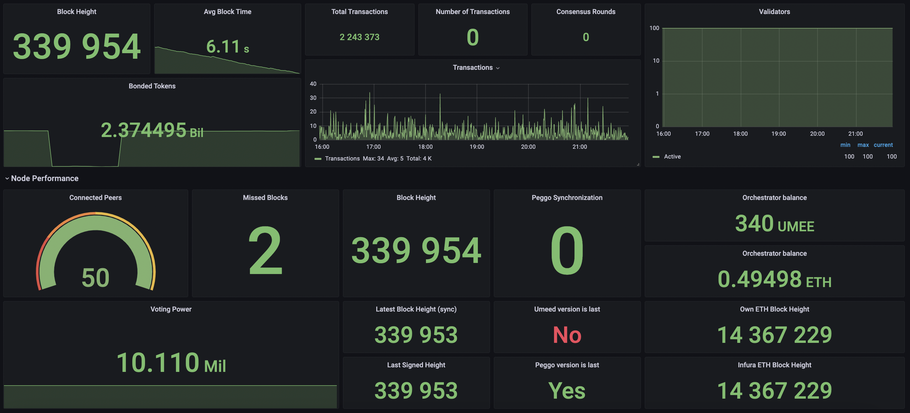
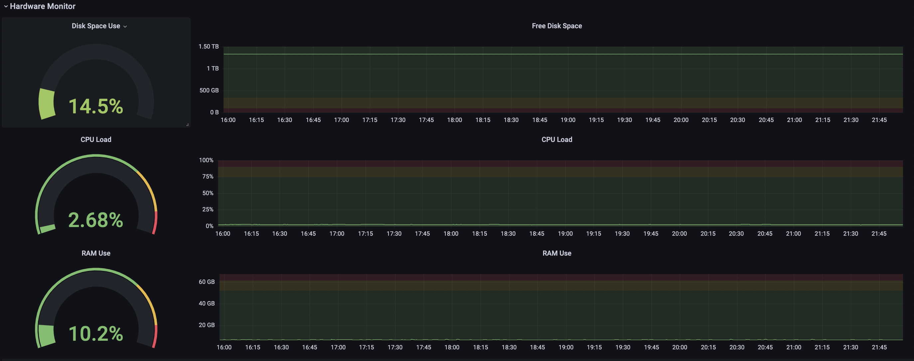

# Grafana dashboard for UMEE blockchain

This instruction allows you to expose UMEE node metrics collected by a [Tendermint exporter](https://docs.tendermint.com/v0.34/tendermint-core/metrics.html) and [Umee exporter](https://github.com/genesis-lab-team/umee-exporter) to a [Prometheus](https://prometheus.io/)/[Grafana](https://grafana.com/) based monitoring system.

You will see the UMEE node metrics


Hardware monitor for your server


These instructions will allow you to retrieve metrics for UMEE node as well as metrics for the server on which the node is running. This setup allows you to get metrics in Prometheus.

* The tendermint node will send their metrics to a monitoring server.
* umee_exporter will expose custom node metrics to Prometheus.
* Prometheus will then scrape node and server metrics at a specified scrape interval.
* Finally you will be able to upload Grafana dashboard and create graphs, alerts and panels based on that metrics.

## Install and config

### STEP 1 - Install and config umee_exporter at your UMEE server

* Go to https://github.com/genesis-lab-team/umee-exporter and follow instructions

### STEP 2 - Configure your Prometheus to receive umee-exporter metrics

* At monitoring server add new target in prometheus.yml
nano /etc/prometheus/prometheus.yml
```
...
- job_name: 'umee_exporter'
    scrape_interval: 5s
    static_configs:
      - targets: [..., '<UMEE_SERVER_IP>:<UMEE_EXPORTER_PORT>']
        labels:
          server: '<SERVER_NAME>'
```
* Save and restart your Prometheus
```
systemctl restart prometheusd
systemctl status prometheusd
```

* Open the Prometheus web interface and now you are able to query the new node metrics.

### STEP 3 - Download umee-mainnet-dashboard.json

## Configure Tendermint node

Tendermint can report and serve the Prometheus metrics, which in their turn can be consumed by Prometheus collector(s).

This functionality is disabled by default.

To enable the Prometheus metrics, set instrumentation.prometheus=true in your config file. Metrics will be served under /metrics on 26660 port by default. Listen address can be changed in the config file (see instrumentation.prometheus\_listen\_addr).

Restart your umeed process
```
systemctl restart umeed
```

## Configure Grafana

* Open Grafana dashboards import page http://127.0.0.1:3000/dashboard/import

* Choose "Upload JSON file" and use uploaded file from STEP 3

* Select Prometheus data source and click import

* Set variables in dashboard:  
instance: <UMEE_SERVER_IP>:<9100>  
instance_umee_exporter: <UMEE_SERVER_IP>:<UMEE_EXPORTER_PORT> 
instance_tendermint_exporter: <UMEE_SERVER_IP>:<26660>